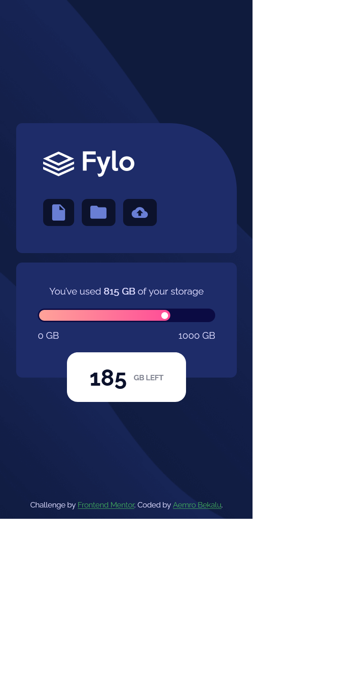

# Frontend Mentor - Fylo data storage component solution

This is a solution to the [Fylo data storage component challenge on Frontend Mentor](https://www.frontendmentor.io/challenges/fylo-data-storage-component-1dZPRbV5n). Frontend Mentor challenges help you improve your coding skills by building realistic projects.

## Table of contents

- [Overview](#overview)
  - [The challenge](#the-challenge)
  - [Screenshot](#screenshot)
  - [Links](#links)
- [My process](#my-process)
  - [Built with](#built-with)
  - [What I learned](#what-i-learned)
  - [Continued development](#continued-development)
  - [Useful resources](#useful-resources)
- [Author](#author)
- [Acknowledgments](#acknowledgments)

## Overview

### The challenge

Users should be able to:

- View the optimal layout for the site depending on their device's screen size

### Screenshot




### Links

- Solution URL: [Add solution URL here](https://your-solution-url.com)
- Live Site URL: [live site URL](https://aemrobe.github.io/fylo-data-storage-component/)

## My process

### Built with

- Semantic HTML5 markup
- CSS custom properties
- Flexbox
- Mobile-first workflow

### What I learned

in this section I have learnt about how I can make a triangle shape. the way we can make the triangle shape is
first we need a div element.

```html
<div></div>
```

then we will style this element inorder to create the triangle shape.

inorder to understand the process which we can use to create the triangle shapes. we will give different colors to the four borders

```css
div {
  border-top: 20px solid black;
  border-bottom: 20px solid red;
  border-left: 20px solid yellow;
  border-right: 20px solid magenta;
}
```

when we add this property to our div element our border right and border left will look like the triangle but our top and bottom border won't look like a triagnle this is because the default value of a width property of a div which is 100%. when we decrease the width property of our div element from 100% to 0% our top and bottom border will look like the triangle and when we make the width to 0, the top and bottom border will completly look like a triangle.

```css
div {
  border-top: 20px solid black;
  border-bottom: 20px solid red;
  border-left: 20px solid yellow;
  border-right: 20px solid magenta;
  width: 0;
}
```

then we will have four borders which look like different color triangles so if we need only one triangle we will make the other three triangles transparent.

for example if we want only the red triangle which is our bottom border. we will make the border color value of the other three border to transparent and we will leave the color value of out bottom border as it is.

```css
div {
  border-top: 20px solid transparent;
  border-bottom: 20px solid red;
  border-left: 20px solid transparent;
  border-right: 20px solid transparent;
  width: 0;
}
```

### Useful resources

- [how we can make shapes using css](https://youtu.be/IhbSuNXNnnU) - This helped me to know how can I make shapes using css.

## Author

- Frontend Mentor - [@aemrobe](https://www.frontendmentor.io/profile/aemrobe)
- Twitter - [@Aemro112](https://www.twitter.com/Aemro112)

## Acknowledgments

I want to say thanks to my team members which always give me comments to my work and who always help me in telling the way which I can fix the problem which I encounter during the challenge.
